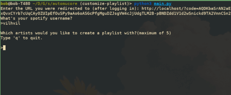

As I just made this for myself, it's not streamlined for other to use, but if you'd like to make it work for yourself follow these instructions:

1. Create a spotify app. Instructions here: https://developer.spotify.com/documentation/web-api/concepts/apps 
2. Go to your dashboard and select your app. Press settings. Replace the placeholder client ID and elient secret in the .env file with your own.
3. Run python3 main.py 

